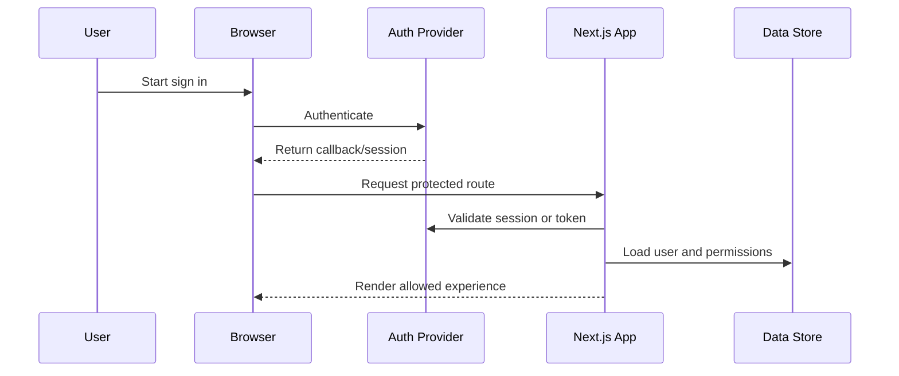

# Security And Access Control

## Document Control

| Field | Value |
| --- | --- |
| Project | {{ProjectName}} |
| Owner | {{SecurityOwner}} |
| Status | {{Draft/In Review/Approved}} |
| Last updated | {{YYYY-MM-DD}} |

## Security Goals

- Protect user data, account access, and business-critical workflows.
- Apply least privilege across routes, APIs, data access, and operations.
- Validate all untrusted input before use.
- Keep secrets out of source control, logs, client bundles, and public assets.
- Make security decisions explicit, testable, and reviewable.

## Authentication

| Area | Decision | Notes |
| --- | --- | --- |
| Provider | {{AuthProvider}} | {{ProviderNotes}} |
| Sign-in methods | {{EmailPassword/OAuth/SSO/MagicLink}} | {{AllowedMethods}} |
| MFA | {{Required/Optional/NotPlanned}} | {{Policy}} |
| Account recovery | {{RecoveryMethod}} | {{RisksAndControls}} |
| Bot protection | {{Captcha/RateLimit/WAF/None}} | {{Policy}} |

## Authorization Model

| Role | Description | Default access | Notes |
| --- | --- | --- | --- |
| {{RoleName}} | {{RoleDescription}} | {{AccessSummary}} | {{Notes}} |
| {{AdminRole}} | {{AdminDescription}} | {{AccessSummary}} | {{Notes}} |

## Permission Matrix

| Resource | Action | Public | Authenticated | {{RoleA}} | {{RoleB}} | Admin |
| --- | --- | --- | --- | --- | --- | --- |
| {{Resource}} | Read | {{Yes/No}} | {{Yes/No}} | {{Yes/No}} | {{Yes/No}} | Yes |
| {{Resource}} | Create | No | {{Yes/No}} | {{Yes/No}} | {{Yes/No}} | Yes |
| {{Resource}} | Update | No | {{Yes/No}} | {{Yes/No}} | {{Yes/No}} | Yes |
| {{Resource}} | Delete | No | No | {{Yes/No}} | {{Yes/No}} | Yes |

## Route Protection

| Route pattern | Access | Protection location | Redirect/error behavior |
| --- | --- | --- | --- |
| `/` | Public | None | N/A |
| `/{{protected-route}}` | {{Authenticated/Role}} | {{Middleware/Layout/Page}} | {{RedirectOr404}} |
| `/api/{{resource}}` | {{Authenticated/Role/System}} | {{RouteHandler}} | {{401/403/ErrorShape}} |

## API And Server Action Protection

- [ ] Validate session before accessing protected data.
- [ ] Check role and resource-level permissions server-side.
- [ ] Validate request body, query params, route params, and headers.
- [ ] Return consistent error responses without exposing sensitive details.
- [ ] Apply rate limits to expensive or abuse-prone endpoints.
- [ ] Log security-relevant failures without logging secrets or full tokens.

## Session And Token Handling

| Concern | Policy |
| --- | --- |
| Session storage | {{HttpOnlyCookie/ProviderManaged/JWT}} |
| Token lifetime | {{Duration}} |
| Refresh policy | {{RefreshStrategy}} |
| Cookie settings | `HttpOnly`, `Secure`, `SameSite={{Mode}}`, `Path={{Path}}` |
| Logout behavior | {{ServerInvalidationAndClientCleanup}} |
| Revocation | {{RevocationStrategy}} |

## OAuth And Third-Party Integrations

| Provider | Scopes | Token storage | Refresh policy | Risk notes |
| --- | --- | --- | --- | --- |
| {{Provider}} | {{Scopes}} | {{StorageLocation}} | {{Policy}} | {{Notes}} |

## Auth Flow

## Input Validation

| Input source | Validation strategy | Failure behavior |
| --- | --- | --- |
| Forms | {{SchemaOrFieldValidation}} | {{InlineErrors}} |
| API bodies | {{SchemaValidation}} | {{400ErrorShape}} |
| URL params | {{TypeAndRangeChecks}} | {{NotFoundOr400}} |
| Webhooks | {{SignatureVerification}} | {{RejectAndLog}} |
| File uploads | {{TypeSizeVirusScanPolicy}} | {{RejectAndNotify}} |

## Rate Limiting And Abuse Prevention

| Surface | Limit | Key | Response |
| --- | --- | --- | --- |
| Sign in | {{Limit}} | {{IPOrAccount}} | {{429OrChallenge}} |
| API writes | {{Limit}} | {{UserIdOrIP}} | {{429ErrorShape}} |
| AI or expensive operations | {{Limit}} | {{UserId/OrgId/Plan}} | {{QuotaMessage}} |
| Public forms | {{Limit}} | {{IPAndFingerprint}} | {{429OrCaptcha}} |

## Common Web Risks

| Risk | Mitigation |
| --- | --- |
| XSS | Escape output, avoid unsafe HTML, sanitize trusted rich text, use CSP where possible. |
| CSRF | Use same-site cookies, CSRF tokens where needed, and server-side session checks. |
| IDOR | Authorize every resource access by user, organization, and role. |
| SQL/NoSQL injection | Use parameterized queries, ORM safeguards, and strict validation. |
| SSRF | Restrict outbound URLs, validate protocols, and avoid fetching arbitrary user URLs server-side. |
| Open redirects | Allowlist redirect targets and normalize URLs before redirecting. |
| Clickjacking | Set frame restrictions with security headers. |

## Secrets Management

- Store secrets in {{SecretManagerOrHostingProviderEnvVars}}.
- Never commit `.env*` files containing real credentials.
- Never expose server-only variables to client code.
- Prefix only intentional public values with the framework-supported public prefix.
- Rotate secrets after suspected exposure, team changes, or vendor guidance.

## Uploads And User Content

| Concern | Policy |
| --- | --- |
| Allowed file types | {{AllowedTypes}} |
| Max file size | {{MaxSize}} |
| Storage location | {{StorageProvider}} |
| Access control | {{SignedURLs/PublicPrivatePolicy}} |
| Malware scanning | {{ScanningPolicy}} |
| Retention/deletion | {{RetentionPolicy}} |

## Logging And Privacy

- [ ] Do not log passwords, tokens, API keys, raw payment data, or sensitive personal data.
- [ ] Redact identifiers where full values are not required.
- [ ] Define retention for logs, analytics, and audit trails.
- [ ] Restrict production log access to authorized operators.
- [ ] Document data deletion and export behavior where applicable.

## Encryption

| Data state | Policy |
| --- | --- |
| In transit | HTTPS/TLS for all public and internal network calls. |
| At rest | {{StorageEncryptionPolicy}} |
| Application-level encryption | {{FieldsOrNone}} |
| Key rotation | {{RotationPolicy}} |

## Security Headers And CORS

| Header/policy | Target value | Notes |
| --- | --- | --- |
| Content-Security-Policy | {{CSPPolicy}} | {{RolloutPlan}} |
| Strict-Transport-Security | {{HSTSValue}} | Production only after HTTPS is stable. |
| X-Frame-Options or frame-ancestors | {{Policy}} | Prevent unwanted framing. |
| Referrer-Policy | {{Policy}} | Limit referrer leakage. |
| CORS | {{AllowedOriginsMethodsHeaders}} | Avoid wildcard origins for protected APIs. |

## Security Review Checklist

- [ ] Authentication flows reviewed.
- [ ] Authorization matrix implemented and tested.
- [ ] Protected pages and APIs reject unauthorized access.
- [ ] Input validation exists for forms, APIs, webhooks, and uploads.
- [ ] Rate limits exist for abuse-prone routes.
- [ ] Secrets are stored outside source control.
- [ ] Logs do not expose sensitive values.
- [ ] Security headers and CORS policies are configured.
- [ ] Dependency audit reviewed before release.
- [ ] Incident response owner and rollback path documented.
