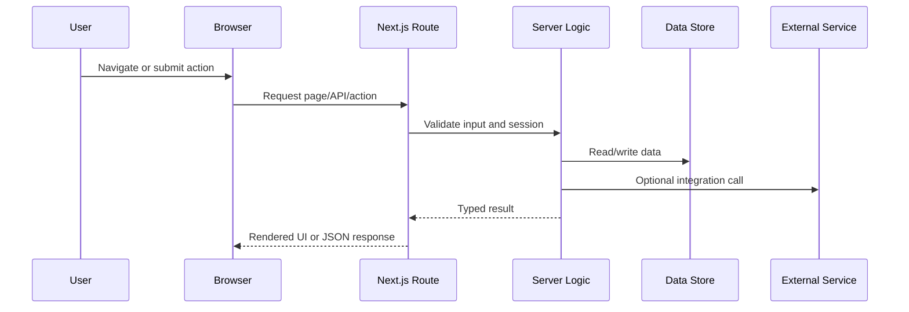
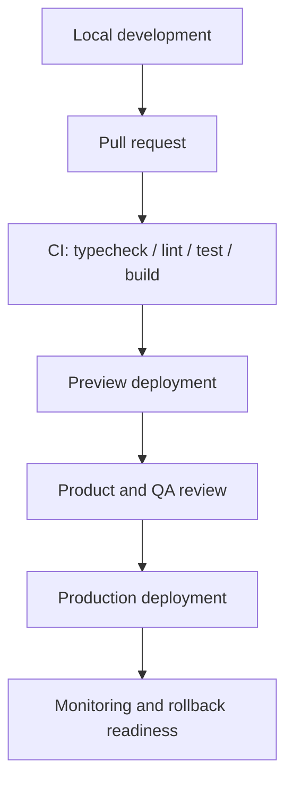

# Technical Architecture

## Document Control

| Field | Value |
| --- | --- |
| Project | {{ProjectName}} |
| Owner | {{TechnicalOwner}} |
| Status | {{Draft/In Review/Approved}} |
| Last updated | {{YYYY-MM-DD}} |

## System Overview

{{ProjectName}} is a {{ProductType}} built with a Next.js App Router and Tailwind CSS foundation. This document describes the expected architecture for routing, UI, data, APIs, integrations, operations, and deployment.

## Architecture Goals

- {{Goal1Example: Keep public pages fast and crawlable}}
- {{Goal2Example: Keep authenticated workflows reliable and observable}}
- {{Goal3Example: Minimize client-side JavaScript unless interactivity requires it}}
- {{Goal4Example: Maintain clear boundaries between UI, server logic, data access, and integrations}}

## Technology Stack

| Layer | Technology | Notes |
| --- | --- | --- |
| Framework | Next.js App Router | {{VersionOrPolicy}} |
| Language | TypeScript | {{StrictnessPolicy}} |
| Styling | Tailwind CSS | {{DesignSystemPolicy}} |
| UI components | {{ComponentApproach}} | {{ReusePolicy}} |
| Data store | {{DatabaseOrNone}} | {{HostingAndAccessPattern}} |
| Auth | {{AuthProviderOrCustom}} | {{SessionStrategy}} |
| Hosting | {{HostingProvider}} | {{RegionsOrRuntimeNotes}} |
| Observability | {{LoggingAnalyticsTracingTools}} | {{RetentionAndAlertingNotes}} |

## High-Level System Diagram

```mermaid
flowchart LR
  User[{{User}}] --> Browser[Browser]
  Browser --> NextApp[Next.js App Router]
  NextApp --> ServerComponents[Server Components]
  NextApp --> RouteHandlers[Route Handlers / Server Actions]
  RouteHandlers --> DataStore[(Data Store)]
  RouteHandlers --> ExternalAPIs[External APIs]
  NextApp --> Observability[Logs / Analytics / Tracing]
```

## Routing Model

| Route | Type | Access | Rendering | Purpose |
| --- | --- | --- | --- | --- |
| `/` | Public page | Public | {{Static/Dynamic}} | {{HomepageOrPrimaryEntry}} |
| `/{{segment}}` | {{Page/Layout/Route handler}} | {{Public/Auth/Admin}} | {{Static/Dynamic}} | {{Purpose}} |
| `/api/{{resource}}` | Route handler | {{Public/Auth/System}} | Dynamic | {{APIPurpose}} |

## Folder Organization

```text
src/
  app/
    layout.tsx
    page.tsx
    {{route-segment}}/
  components/
    {{shared-components}}
  lib/
    {{server-and-shared-utilities}}
  hooks/
    {{client-hooks}}
  types/
    {{shared-types}}
  styles/
    {{optional-style-modules}}
```

## Component Architecture

| Component type | Location | Default rendering | Guidance |
| --- | --- | --- | --- |
| Page components | `src/app/**/page.tsx` | Server | Fetch route-level data close to the route. |
| Layout components | `src/app/**/layout.tsx` | Server | Own shared route chrome and metadata. |
| Shared UI | `src/components` | Server unless interactive | Keep props typed and reusable. |
| Client UI | `src/components` or route-local folders | Client | Use only when state, effects, browser APIs, or event handlers are required. |
| Utilities | `src/lib` | Server/shared | Keep framework-specific and domain helpers separated. |

## Request Flow



## Data Architecture

| Data domain | Source of truth | Access pattern | Validation | Notes |
| --- | --- | --- | --- | --- |
| {{DomainEntity}} | {{Database/API/File}} | {{ServerAction/RouteHandler/ServerComponent}} | {{SchemaOrRules}} | {{Notes}} |
| {{DomainEntity}} | {{Database/API/File}} | {{ServerAction/RouteHandler/ServerComponent}} | {{SchemaOrRules}} | {{Notes}} |

## API Design

| Endpoint/action | Method | Auth | Input | Output | Errors |
| --- | --- | --- | --- | --- | --- |
| `/api/{{resource}}` | {{GET/POST/PATCH/DELETE}} | {{Required/Optional/Public}} | {{InputShape}} | {{OutputShape}} | {{ErrorCodes}} |
| `{{serverActionName}}` | Server Action | {{Required/Optional/Public}} | {{InputShape}} | {{OutputShape}} | {{ErrorCodes}} |

## Authentication And Authorization

| Concern | Decision |
| --- | --- |
| Auth provider | {{Provider}} |
| Session strategy | {{Cookie/JWT/ProviderManaged}} |
| Route protection | {{Middleware/Layout/API-level checks}} |
| Role model | {{Roles}} |
| Permission checks | {{CentralizedPolicyOrInlinePattern}} |

## Caching Strategy

| Layer | What is cached | Invalidation | Notes |
| --- | --- | --- | --- |
| Browser | {{AssetsOrResponses}} | {{TTLOrHeaders}} | {{Notes}} |
| Next.js data cache | {{FetchesOrPages}} | {{Tags/Revalidation/NoStore}} | {{Notes}} |
| CDN/edge | {{StaticAssetsOrPages}} | {{DeployOrPurge}} | {{Notes}} |
| Application cache | {{ComputedData}} | {{TTL/EventDriven}} | {{Notes}} |

## Background Jobs And Async Work

| Job | Trigger | Frequency | Runtime | Failure handling |
| --- | --- | --- | --- | --- |
| {{JobName}} | {{Cron/Event/UserAction}} | {{Schedule}} | {{Runtime}} | {{RetryAlertOrDLQ}} |

## Environment Variables

| Variable | Environment | Required | Description | Example |
| --- | --- | --- | --- | --- |
| `{{ENV_VAR_NAME}}` | {{Local/Preview/Production}} | {{Yes/No}} | {{Purpose}} | `{{ExampleValue}}` |
| `{{ENV_VAR_NAME}}` | {{Local/Preview/Production}} | {{Yes/No}} | {{Purpose}} | `{{ExampleValue}}` |

## Deployment Flow



## CI/CD

| Stage | Checks | Required before merge |
| --- | --- | --- |
| Install | {{PackageManagerInstallCommand}} | Yes |
| Type check | {{TypeCheckCommand}} | Yes |
| Lint | {{LintCommand}} | Yes |
| Test | {{TestCommand}} | {{Yes/No}} |
| Build | {{BuildCommand}} | Yes |
| E2E | {{E2ECommand}} | {{Yes/No}} |

## Observability

| Signal | Tool | Events/metrics | Alert threshold |
| --- | --- | --- | --- |
| Logs | {{LoggingTool}} | {{ImportantLogs}} | {{Threshold}} |
| Errors | {{ErrorTrackingTool}} | {{ErrorEvents}} | {{Threshold}} |
| Analytics | {{AnalyticsTool}} | {{ProductEvents}} | {{Threshold}} |
| Performance | {{PerformanceTool}} | {{WebVitalsOrLatency}} | {{Threshold}} |

## Scalability And Performance

- Prefer Server Components for static and data-heavy UI.
- Keep client components narrowly scoped to interactive behavior.
- Use lazy loading for heavy UI and media where appropriate.
- Optimize images with explicit dimensions and responsive sizes.
- Define caching and revalidation per route based on data freshness requirements.
- Monitor bundle size, Core Web Vitals, API latency, and error rates.

## Architecture Decision Records

| ID | Decision | Alternatives | Rationale | Date |
| --- | --- | --- | --- | --- |
| ADR-001 | {{Decision}} | {{Alternatives}} | {{Rationale}} | {{YYYY-MM-DD}} |
